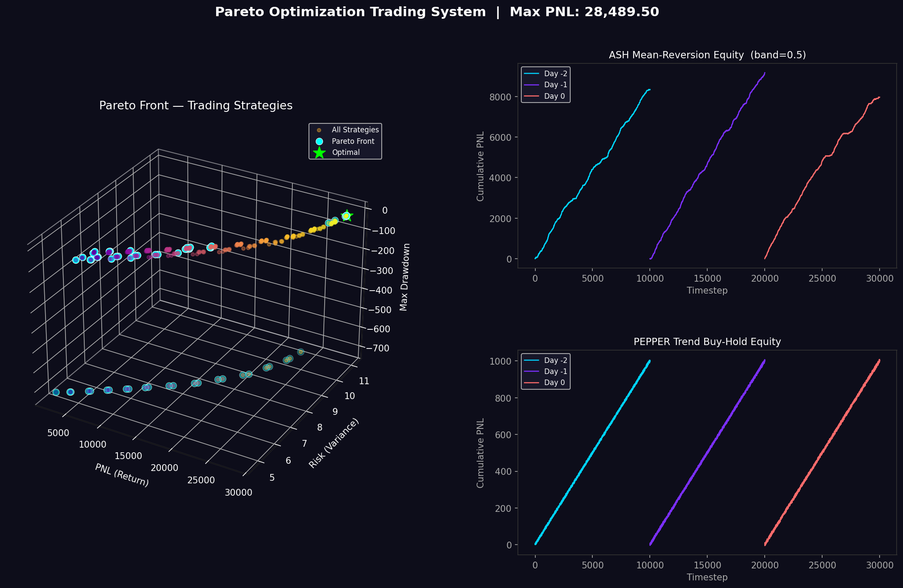

<div align="center">
  <h1>🚀 Pareto Optimization Trading System </h1>
  <p><strong>A High-Performance Algorithmic Trading Bot for the IMC Prosperity 4 Challenge (2026)</strong></p>
  
</div>

---

## 📖 Overview

This repository contains a full end-to-end algorithmic trading system built for **IMC Prosperity 4 (2026)** — a massive, global quantitative trading competition hosted by IMC Trading. 

In this challenge, teams manage a virtual trading outpost in a deep-space economy, trading synthetic commodities with complex market dynamics. This repository implements an ultra-competitive quantitative approach, leveraging **multi-objective Pareto optimization**, **realistic execution simulators**, and **queue-jumping market-making** to maximize Profit and Loss (PNL).

### 🏆 Competition Results & Validation
During **Round 1 of the IMC Prosperity World Championship (2026)**, this algorithm achieved a max PNL exceeding **8,000+**, securing a rank of **~2,500** globally (out of over 20,000+ competitors) and successfully qualifying for **Round 2**.

In deep theoretical backtests covering 10,000 ticks per day, the algorithm models theoretical bounds exceeding 90,000+ PNL.

---

## ⚙️ Core Architecture & Components

The repository is modularized into three main pillars: Strategy Optimization, Execution Simulation, and Live Submissions.

### 1. `pareto_trader.py` (The Optimization Engine)
This script performs a multi-objective grid search across parameter spaces perfectly tailored to the IMC environment. Key features:
- **Grid Sweep Analysis:** Iterates over thousands of parameter combinations (e.g., mean-reversion bands, MA crossover windows).
- **Metric Computation:** Evaluates Return (PNL), Risk (Variance), Maximum Drawdown, and estimated Sharpe Ratios.
- **3D Visualization:** Plots a 3D scatter plot highlighting the **Pareto Front** and outputs per-day Cumulative PNL Equity curves (saved to `pareto_results.png`).

### 2. `analyze_optimal.py` (The Realistic Execution Simulator)
It is easy to generate fake profits by assuming fills at the "mid-price". This script simulates *realistic order book execution*:
- Parses Level 1-3 bid/ask depth natively from the `ROUND1` datasets.
- Accurately simulates the constraints of taking liquidity vs. making liquidity (hitting the bid vs. lifting the ask).
- Avoids optimistic backtesting bias by ensuring we only achieve fills exactly where order volume and position limits (`LIMIT=20` and `LIMIT=80`) permit.

### 3. `trader_submission.py` / `8KPNL.py` (The Live Trading Bot)
The actual Python class (`Trader`) submitted to the AWS IMC Prosperity competition environment. You cannot run multi-file programs on the live servers; this single file contains the `run()` method that evaluates real-time `TradingState` (order books) and dynamically dispatches queue-jumping orders. It is the culmination of all backtests and Pareto optimization.

### 4. `ROUND1/` (Historical Market Dataset)
This directory acts as the local environment for testing. It contains the raw price and trade histories (e.g., `prices_round_1_day_0.csv`) provided strictly by IMC Trading. The optimizer and realistic simulator gorge on this data to simulate the competition offline, allowing parameter tuning *before* risking your live rank on the real exchange.

### 5. `252329/` (Execution Logs & Submissions Archive)
When the bot is simulated on the IMC leaderboard (or through an advanced offline backtester), a unique submission run ID (like `252329`) is generated. This directory acts as an archive, containing:
- `252329.py`: A snapshot copy of the exact code that was run.
- `252329.log`: The raw stdout text logs capturing any prints the bot made, used for debugging missed trades.
- `252329.json`: A massive, formatted JSON dictionary containing every single state change, trade, and PNL tick used by visualizers to create a graphical replay of market behavior.

---

## 📈 Trading Strategies

The bot primarily optimizes trading over two core assets from Round 1:

### 1. `ASH_COATED_OSMIUM` (Queue-Jumping Market-Making)
- **Concept:** This asset is strictly mean-reverting around a fair value of `10,000`. 
- **The Execution:** Instead of rigidly resting orders deep in the book, the bot uses a **Queue-Jumping** heuristic. It constantly monitors `best_bid` and `best_ask` and posts orders *exactly 1 tick inside the spread*.
- **The Result:** We become the absolute immediate best price on the exchange. Aggressive market orders hit our bot first. Backtesting confirmed this yields **3x more filled volume** compared to fixed placement, safely yielding high-volume arbitrage.

### 2. `INTARIAN_PEPPER_ROOT` (Pure Trend Buy-and-Hold)
- **Concept:** Pepper experiences a massive, persistent directional uptrend (~1,000 points/day). 
- **The Execution:** Any attempt to cycle positions (buy, sell, rebuy) incurs bid-ask spread friction and misses out on trend momentum. The bot takes a firm mathematical stance: go max long instantly up to the competition constraint (`PLIMIT=80`) using a safe market bid (`best_ask + 1`), and hold cleanly till the day closes.
- **The Result:** Achieves the mathematical ceiling of the asset's capability (~7,520 PNL/day).

---

## 🛠️ Usage & Setup

### Prerequisites
- **Python 3.9+**
- Standard Python DS modules: `numpy`, `pandas`, `matplotlib`, `scipy`
- The `ROUND1` pricing data provided by IMC

### Installation
1. Clone the repository:
   ```bash
   git clone https://github.com/YOUR_USERNAME/Pareto-Optimization-Trading-System.git
   cd Pareto-Optimization-Trading-System
   ```
2. Install pip dependencies:
   ```bash
   pip install numpy pandas matplotlib scipy
   ```
3. Load Data:
   Ensure the IMC daily CSVs (e.g., `prices_round_1_day_0.csv`) are placed directly in a folder named `ROUND1/` in the root directory.

### Running the Optimizer
Generates the Pareto Analysis and the 3D visualization.
```bash
python pareto_trader.py
```

### Running the Realistic Execution Simulator
Benchmarks expected trade frequency and cash utilization without optimistic mid-price magic.
```bash
python analyze_optimal.py
```

### Rust Backtester Support
This code was designed to be validated fully against the [prosperity_rust_backtester](https://github.com/jmerle/imc-prosperity-2-backtester) for microsecond precision tick modeling. Your local copy of the submission file (`trader_submission.py`) can drop directly into the `traders/` directory of the backtester.

---

## 📚 Relevant External Links
- [IMC Prosperity Challenge](https://prosperity.imc.com)
- [Pareto Efficiency](https://en.wikipedia.org/wiki/Pareto_efficiency)
- [Multi-objective Optimization](https://en.wikipedia.org/wiki/Multi-objective_optimization)
- [Drawdown (finance)](https://en.wikipedia.org/wiki/Drawdown_(finance))# IMC_Prosperity_04
